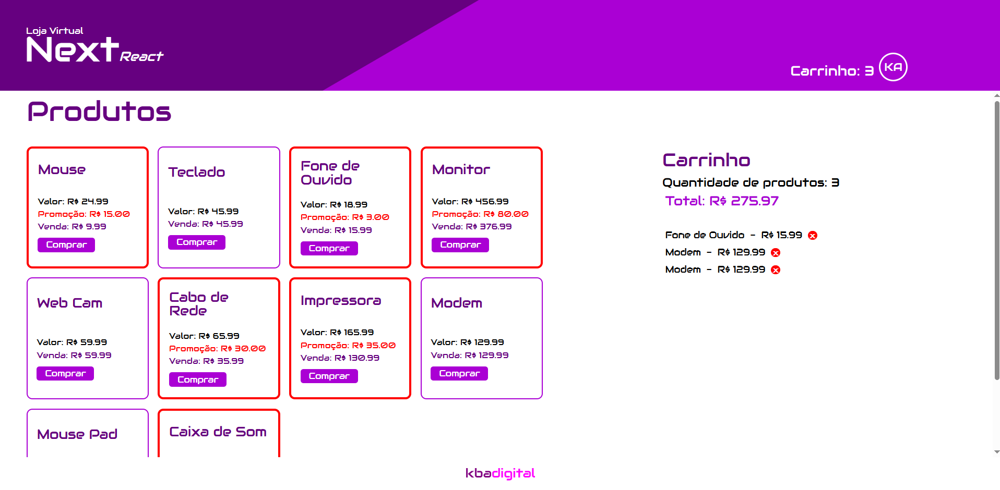

# Loja Virtual
## Next.js/ **React**

Acesse a aplicação: [Loja Virtual]()

## Objetivo

A aplicação Loja Virtual demonstra, de forma simples, a navegação e compra de produtos utilizando Next.js e React.

O acesso à compra é controlado por cadastro e login do usuário.

Os produtos são manipulados em um array, permitindo adicionar e remover itens.

O projeto destaca boas práticas de organização de código por pastas e responsabilidades.

Também exemplifica o uso de useState, rotas, props e interfaces no desenvolvimento.

## Finalidade

* Demonstrar o fluxo básico de uma loja virtual (navegação, login e compra)
* Exemplificar a manipulação de dados com array (adicionar e remover produtos)
* Aplicar conceitos fundamentais de React (useState, props e interfaces)
* Utilizar rotas para navegação entre páginas no Next.js
* Evidenciar boas práticas de organização e estruturação do código

## Start

-   npm run dev

## Dependências

- tailwindcss
- typescript

## Contatos
- E-mail: [kba.2879@gmail.com](mailTo:kba.2879@gmail.com)
- Linkedin: [/katarine-albuquerque](https://www.linkedin.com/in/katarine-albuquerque/)
